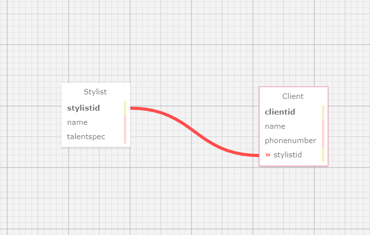

# _HairSalon.Solution_

#### _Application for Keeping track of Stylist in your Hair Salon_

#### By **Erik Z./ molagg 92**

## Technologies Used

* _C#_
* _.NET v6.0_
* _RazorSyntax_
* _MySql_
* _Git_
* _VSCode_

## Description

_ This is a handy little application that uses one to many relationship between Stylists and Clients. This app can riliably track how many Stylists you have working for you, and the clients taht are assignes to each stylist_

## Setup/Installation Requirements

* _Clone "HairSalon.Solution“ from the repository to your desktop_
* _Navigate to "HairSalon.Solution" directory via your local terminal command line_
* _Navigate to the production directory "HairSalon"_
* _Navigate to the HairSalon folder in your terminal_
* _Then type ***dotnet build*** in your terminal to make sure everything is up to date and there are no errors_
* _Then launch the webpage by typing ***dotnet watch run --launch-profile "production"*** in the teminal_
* _For issuing and trusting a security certificate, type ***dotnet dev-certs https --trust*** in the terminal and restart your browser_

## Known Bugs

* _Currently, when you go in tro Client details and try to edit a clients details, after saving the changes instead of updateing the same client this app just adds the changes as a new client. It is recomended that you delete the old imput of a client after you make a change to their account. as of 07/29/23_

## License

MIT License

Copyright (c) [2023] [Your Name Here]

Permission is hereby granted, free of charge, to any person obtaining a copy
of this software and associated documentation files (the "Software"), to deal
in the Software without restriction, including without limitation the rights
to use, copy, modify, merge, publish, distribute, sublicense, and/or sell
copies of the Software, and to permit persons to whom the Software is
furnished to do so, subject to the following conditions:

The above copyright notice and this permission notice shall be included in all
copies or substantial portions of the Software.

THE SOFTWARE IS PROVIDED "AS IS", WITHOUT WARRANTY OF ANY KIND, EXPRESS OR
IMPLIED, INCLUDING BUT NOT LIMITED TO THE WARRANTIES OF MERCHANTABILITY,
FITNESS FOR A PARTICULAR PURPOSE AND NONINFRINGEMENT. IN NO EVENT SHALL THE
AUTHORS OR COPYRIGHT HOLDERS BE LIABLE FOR ANY CLAIM, DAMAGES OR OTHER
LIABILITY, WHETHER IN AN ACTION OF CONTRACT, TORT OR OTHERWISE, ARISING FROM,
OUT OF OR IN CONNECTION WITH THE SOFTWARE OR THE USE OR OTHER DEALINGS IN THE
SOFTWARE.

_If you run into any issues or have questions, ideas or concerns, please reach out to me via email: molagg92@gmail.com.  Contributions to the code are highly encouraged._